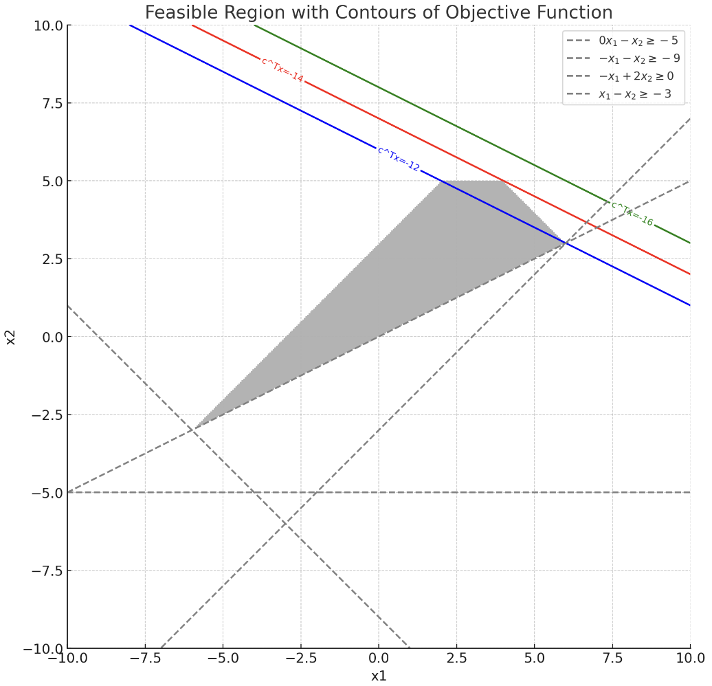
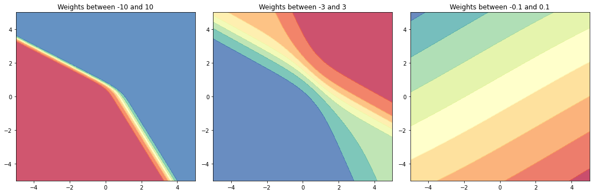

# CSDS440 Written Homework 4
**Instructions:** Each question is worth 10 points unless otherwise stated. Write your answers below the question. Each answer should be formatted so it renders properly on github. **Answers that do not render properly may not be graded.** Please comment the last commit with "FINAL COMMIT" and **enter the final commit ID in canvas by the due date.** 

When working as a group, only one answer to each question is needed unless otherwise specified. Each person in each group must commit and push their own work. **You will not get credit for work committed/pushed by someone else even if done by you.** Commits should be clearly associated with your name or CWRU ID (abc123). Each person is expected to do an approximately equal share of the work, as shown by the git logs. **If we do not see evidence of equal contribution from the logs for someone, their individual grade will be reduced.** 

Names and github IDs (if your github ID is not your name or Case ID):

1.	Show that the set $C=$ \{ $x|Ax\geq b$ \}, $A \in R^{m\times n}$, $x \in R^n$, $b \in R^m$, is a convex set. Note that this describes the constraint set of a linear program. (10 points)

Answer: 
To show that a set $C$ is convex we have to show that for any two points $x_{1}, x_{2} \in C$ and any $\lambda$ such that $0 \leq \lambda \leq 1$, the point $z = \lambda x_{1} + (1 - \lambda ) x_{2}$ also lies in $C$.

Given:
$C = \{x|Ax \geq b\}$

take any two points $x_{1}, x_{2} \in C$, meaning:

$Ax_{1} \geq b$

$Ax_{2} \geq b$

We must show that 

$A(\lambda x_{1} + (1 - \lambda) x_{2}) \geq b$

*Proof:*
Take

$Ax_{1} \geq b$

$Ax_{2} \geq b$

and multiply each by $\lambda$ and $(1-\lambda)$

$\lambda A x_{1} \geq \lambda b$

$(1-\lambda)Ax_{2} \geq (1-\lambda)b$

Next we add the two inequalities

$\lambda A x_{1} + (1-\lambda)Ax_{2} \geq  (1-\lambda)b + \lambda b$

Since $\lambda + (1-\lambda) = 1$

$(1-\lambda)b + \lambda b = b$

and

$\lambda A x_{1} + (1-\lambda)Ax_{2} \geq b$

Here we have shown through a direct proof that $\lambda x_{1} + (1-\lambda) x_{2}$ satisfies the inequality $Ax \geq b$ 

Therefore, the point $z$ lies in $C$

Since $z = \lambda x_{1} + (1 - \lambda ) x_{2}$ and $z$ represents a linear combination of any two points $x_{1}, x_{2} \in C$ this means that $C$ is a convex set.

2.	A function $f$ is said to have a global minimum at $x$ if for all $y$, $f(y) \geq f(x)$. It is said to have a local minimum at $x$ if there exists a neighborhood $H$ around $x$ so that for all $y$ in $H$, $f(y)\geq f(x)$. Show that, if $f$ is convex, every local minimum is a global minimum. [Hint: Prove by contradiction using Jensen’s inequality.] (10 points)

Answer: 

Jensen's Inequality states that for a convex function $f$, any two points $x$ and $y$, and any $\lambda$ such that $0 \leq \lambda \leq 1$, the following inequality holds.

$f(\lambda x + (1 - \lambda)y \leq \lambda f(x) + (1-\lambda)f(y))$

Proof:

Assume that $f$ has a local minimum at $x$ that is not a global minimum. This means $\exists y \cancel{=} x$ such that $f(y) < f(x)$

Since $f$ is convex, for any $\lambda \in (0,1)$, Jensen's inequality applies to the points $x$ and $y$. Let's construct a point $z$ that lies on the line between $x$ and $y$ as follows:

Let:

$z = \lambda x + (1-\lambda) y$

By Jensen's Inequality, we have:

$f(z) \leq \lambda f(x) + (1-\lambda) f(y)$

Because $f(y) < f(x)$, we can say:

$\lambda f(x) + (1-\lambda) f(y) < \lambda f(x) + (1-\lambda) f(x) = f(x)$

Which gives us:

$f(z) < f(x)$

Since $x$ is a local minimum, there exists a neighborhood $H$ around $x$ such that $f(x) \leq f(u)$ for all $u \in H$. We can choose a $\lambda$ close to $1$ that makes $z$ as close to $x$ as we want. This means that the point $z$ can be within the neighborhood of points $H$ near $x$. We have shown above, however, that $f(z) < f(x)$, which contradicts the definition of $x$ being a local minimum since we have just constructed a point $z$ whose $f(z)$ is smaller than $f(x)$ and this point $z$ is local to $x$.

Due to our given there cannot be a point $y$ such that $f(y) < f(x)$, therefore the local minimum at $x$ must also be the global minimum. Because of the above contradiction our given statement must be true. This means that for a convex function $f$, every local minimum must also be a global minimum. 

3.	Consider the LP: $\min c^Tx$ s.t. $Ax \geq b, x \geq 0$, where $T$ is the transpose, $A$ is the 4x2 matrix: \[ 0 −1; −1 −1; −1 2; 1 −1\], $b$ is a 4x1 vector \[−5; −9;0; −3\] and $c$ is a 2x1 vector \[−1; −2\]. (a) Draw the feasible region in $R^2$. (b) Draw the contours of $c^Tx =−12$, $c^Tx =−14$ and $c^Tx =−16$ and determine the solution graphically. (10 points)

Answer: 

The feasible region is colored light gray and it represents the points $(x_{1},x_{2})$ that satisfy the given inequalities $Ax \geq b$ and $x \geq 0$

The boundaries of the feasible region are depicted with dashed gray lines, corresponding to the equations derived from each inequality of $Ax \geq b$ 

The countours of the objective function $c^{T}x$ for the levels $-12$, $-14$, and $-16$ are shown in blue, red and green respectively. These countours represent the sets of points where the objective function takes on those constant values. 

To determine the solution graphically, we look for the point or points within the feasible region where the contours of the objective function are at their lowest value because we are dealing with a minimization problem. The optimal solution will be at a vertex of the feasible region where the contour line is tangent to the region or where the last contour line intersects the feasible region before it moves outside the region.

From the plot, we can infer that the optimal solution is located at the intersection of the contour line for  $c^Tx =−14$ (red) with the feasible region. The exact coordinates of this point can be calculated numerically or by observing the intersection of the constraints that form that vertex of the feasible region.

Certainly! The solution to the given linear programming problem can be written as follows in LaTeX:

Given the LP problem:

$$
\begin{align*}
\text{minimize} \quad & c^T x \\
\text{subject to} \quad & Ax \geq b \\
& x \geq 0
\end{align*}
$$

where $A$ is a $( 4 \times 2 )$ matrix, $( b )$ is a $(4 \times 1 )$ vector, and $(c)$ is a $( 2 \times 1 )$ vector:

$$
A = \begin{bmatrix}
0 & -1 \\
-1 & -1 \\
-1 & 2 \\
1 & -1
\end{bmatrix}, \quad
b = \begin{bmatrix}
-5 \\
-9 \\
0 \\
-3
\end{bmatrix}, \quad
c = \begin{bmatrix}
-1 \\
-2
\end{bmatrix}
$$

The solution, obtained by using linear programming optimization techniques, is:

$$
x = \begin{bmatrix}
4 \\
5
\end{bmatrix}
$$

At this point, the value of the objective function $( c^T x )$ is:

$$
c^T x = -14
$$

This is the minimum value of the objective function within the feasible region defined by the constraints.

4.	Consider the primal linear program (LP): $\min c^Tx$ s.t. $Ax \geq b, x \geq 0$ and its dual: $\max b^Tu$ s.t. $A^Tu \leq c, u \geq 0$. Prove that for any feasible $(x,u)$ (i.e. $x$ and $u$ satisfying the constraints of the two LPs), $b^Tu \leq c^Tx$. (10 points)

Answer: 

From the provided primal LP and dual LP: $Ax \geq b, A^Tu \leq c$:

By minimize primal LP and maximize dual LP, we get $x \geq 0$ and $u \geq 0$

We need to prove: $b^Tu \leq c^Tx$

Proof:

1. primal LP mult u: $u^TAx \geq u^Tb$, this results in the inequality with function: $uA^Tx^T \geq ub^T$

2. dual LP mult x: $x^TA^Tu \leq x^Tc$

We know x and u are non-negative, the direction of the inequality will not change.

With comnination of these 2 functions, we can know $x^TA^Tu$ greater/equal than $ub^T$, and less than $x^Tc$, we get $ub^T \leq x^Tc$.

For transposing both sides of $ub^T \leq x^Tc$, finally we have $b^Tu \leq c^Tx$. And proved this is true that for any feasible $(x,u)$.

~~Since $u^TAx%$ and $x^TA^Tu$ are equivalent because of the properties of matrix multiplication and the dot product.(might need proof)~~

~~We replace $u^TAx$ from equation 1 with $x^TA^Tu$ and get $x^TA^Tu \geq u^Tb$, also from equation 2, we replace $x^TA^Tu$ with $x^Tc$, and finally we have $b^Tu \leq c^Tx$.~~

5.	Derive the backpropagation weight updates for hidden-to-output and input-to-hidden weights when the loss function is cross entropy with a weight decay term. Cross entropy is defined as $L(\mathbf{w})=\sum_i y_i\log{(\hat{y}_i)}+(1-y_i)\log{(1-\hat{y}_i)}$ , where $i$ ranges over examples, $y_i$ is true label (assumed 0/1) and $\hat{y}_i$  is the estimated label for the $i^{th}$ example. (10 points)

Answer:
To derive the backpropagation weight updates for hidden-to-output and input-to-hidden weights with the cross-entropy loss function including a weight decay term, we will need to perform gradient descent on the loss function.

First, let's define the loss function with the weight decay term:

$$
L(\mathbf{w}) = -\sum_i \left[ y_i \log(\hat{y}_i) + (1 - y_i) \log(1 - \hat{y}_i) \right] + \frac{\lambda}{2} \|\mathbf{w}\|^2
$$

where:
- $(L(\mathbf{w}))$ is the loss function.
- $( y_i )$ is the true label for the $( i^{th} )$ example, which is 0 or 1.
- $( \hat{y}_i )$ is the predicted probability for the $( i^{th} )$ example by the model.
- $( \mathbf{w} )$ represents the weights of the model.
- $( \lambda )$ is the weight decay parameter.

The weight decay term $( \frac{\lambda}{2} \|\mathbf{w}\|^2 )$ is also known as L2 regularization, and it penalizes large weights in the model.

Now, let's perform the derivation for the weight updates.

*Hidden-to-Output Weights*

The derivative of the cross-entropy loss with respect to the weights  $w_{ho}$ is:

$$
\frac{\partial L}{\partial w_{ho}} = -\sum_i \left( \frac{y_i}{\hat{y}_i} - {1 - y_i}{1 - \hat{y}_i} \right) {\partial \hat{y}_i}{\partial w_{ho}} + \lambda w_{ho}
$$ 

Since the output unit uses a sigmoid activation function, we have:

$$
\hat{y}_i = \sigma(z_i)
$$

where $z_i$ is the input to the output unit, and $\sigma$ is the sigmoid function. The derivative of  $\hat{y}_i$ with respect to  $w_{ho}$ is then:

$$
\frac{\partial \hat{y}_i}{\partial w_{ho}} = \frac{\partial \sigma(z_i)}{\partial z_i} \frac{\partial z_i}{\partial w_{ho}} = \hat{y}_i (1 - \hat{y}_i) h
$$

Substituting this into the derivative of $L$ with respect to $w_{ho}$, we get:

$$
\frac{\partial L}{\partial w_{ho}} = -\sum_i \left( y_i - \hat{y}_i \right) h + \lambda w_{ho}
$$

Therefore, the weight update rule for $w_{ho}$ is:

$$
w_{ho} \leftarrow w_{ho} - \alpha \frac{\partial L}{\partial w_{ho}}
$$

where $\alpha$ is the learning rate.

*Input-to-Hidden Weights* $w_{ih}$

The derivative of the loss function with respect to $w_{ih}$ involves applying the chain rule, as the output depends on the hidden layer which in turn depends on the input-to-hidden weights.

$$
\frac{\partial L}{\partial w_{ih}} = -\sum_i \left( \frac{y_i}{\hat{y}_i} - \frac{1 - y_i}{1 - \hat{y}_i} \right) \frac{\partial \hat{y}_i}{\partial h} \frac{\partial h}{\partial w_{ih}} + \lambda w_{ih}
$$

Since $h$ is the output of the hidden layer's sigmoid activation, we have:

$$
\frac{\partial \hat{y}_{i}}{\partial h} = w_{ho} \hat{y}_{i} (1 - \hat{y}_{i})
$$

and

$$
\frac{\partial h}{\partial w_{ih}} = h (1 - h) x
$$

Putting it all together, we get:

$$
\frac{\partial L}{\partial w_{ih}} = -\sum_i \left( y_i - \hat{y}_i \right) w_{ho} h (1 - h) x + \lambda w_{ih}
$$

And the weight update rule for $w_{ih}$ is:

$$
w_{ih} \leftarrow w_{ih} - \alpha \frac{\partial L}{\partial w_{ih}}
$$

By applying these update rules iteratively, we can train the neural network using gradient descent to minimize the cross-entropy loss function, including the

 effect of the weight decay term which helps to prevent overfitting by penalizing large weights.

6.	Consider a neural network with a single hidden layer with sigmoid activation functions and a single output unit also with a sigmoid activation, and fixed weights. Show that there exists an equivalent network, which computes exactly the same function, where the hidden unit activations are the $\tanh$ function shown in class, and the output unit still has a sigmoid activation. (10 points)

Answer:
To show that a neural network with sigmoid activation functions is equivalent to one with hyperbolic tangent $(\tanh)$ activation functions in the hidden layer, we need to understand the relationship between the sigmoid function, $\sigma(x)$, and the $tanh$ function.

The sigmoid function is defined as:

$$
\sigma(x) = \frac{1}{1 + e^{-x}}
$$

The hyperbolic tangent function is defined as:

$$
\tanh(x) = \frac{e^{x} - e^{-x}}{e^{x} + e^{-x}}
$$

The relationship between these two functions is given by:

$$
\tanh(x) = 2\sigma(2x) - 1
$$

Or equivalently, if you solve for \(\sigma(x)\), you get:

$$
\sigma(x) = \frac{1}{2}(\tanh(\frac{x}{2}) + 1)
$$

Now, let's consider a network with a single hidden layer with sigmoid activation functions. Suppose the input to a particular neuron in the hidden layer is denoted by $h$ (which is the weighted sum of the inputs to that neuron), and the output of that neuron after the sigmoid activation is $\sigma(h)$.

In the equivalent network with $\tanh$ activations, to compute the same function, the input to the $\tanh$ neuron should be scaled and shifted so that the output matches the sigmoid output from the original network. If the input to the $\tanh$ neuron is $ h' $, we want to find a transformation such that:

$$
\sigma(h) = \frac{1}{2}(\tanh(\frac{h'}{2}) + 1)
$$

For this to be true for all inputs $h$, we must have $h' = 2h$, so the output from the $\tanh$ neuron would be:

$$
\tanh(h') = \tanh(2h) = 2\sigma(h) - 1
$$

However, because the $\tanh$ function produces outputs in the range $(-1, 1)$ and the sigmoid function produces outputs in the range $(0, 1)$, we need to scale and shift the output of the $\tanh$ function to match that of the sigmoid function. This is done by multiplying the $\tanh$ output by $\frac{1}{2}$ and adding $\frac{1}{2}$, resulting in the right side of the relationship we established above.

The key point here is that the activation of the hidden unit with the $\tanh$ function is scaled and shifted to match the range of the sigmoid function. Because these transformations are linear, the weights and biases of the neurons can be adjusted accordingly to account for this change in activation functions, without changing the function that the network computes.

In conclusion, for every hidden unit with a sigmoid activation, there exists a corresponding hidden unit with a $\tanh$ activation that computes the same function, by appropriately scaling and shifting the input. The output unit remains with a sigmoid activation in both networks, ensuring that the final output of the network also remains unchanged.

7.	Draw an artificial neural network structure which can perfectly classify the examples shown in the table below. Treat attributes as continuous. Show all of the weights on the edges. For this problem, assume that the activation functions are sign functions instead of sigmoids. Propagate each example through your network and show that the classification is indeed correct.
(10 points)
 
|x1	|x2	|Class|
|---|---|-----|
|−4	|−4	|−|
|−1	|−1	|+|
| 1	| 1	|+|
| 4|  4	|−|

Answer:

This is what we can find: for x1 and x2, they are the same in each example, and the positive and negative doesn't affect the class. They only classified by the range to the origin.

Now wo choose 2.5 as the pivot, which the midpoint between 1 and 4.

Weights and perceptrons:

Perceptron A: $y_A$ = sign(2.5*2-(|x1|+|x2|)),  weights based on the mean points of x1, x2 less than 2.5.

Perceptron B: $y_B$ = sign((|x1|+|x2|)-2.5*2),  weights based on the mean points of x1, x2 greater than 2.5.

Perceptron C: weight +1 for activated A and -1 for activated B.

Provided examples:

For (-4,-4) and (4,4): B activates (giving output +1), A doesn't. C output negative (-)
For (-1,-1) and (1,1): A activates (giving output +1), B doesn't. C output positive (+)

8.	Using R/Matlab/Mathematica/python/your favorite software, plot the decision boundary for an ANN with two inputs, two hidden units and one output. All activation functions are sigmoids. Each layer is fully connected to the next. Assume the inputs range between −5 to 5 and fix all activation thresholds to 0. Plot the decision boundaries for  the weights except the thresholds randomly chosen between (i) (−10,10), (ii) (−3,3), (iii) (−0.1,0.1) (one random set for each case is enough). Use your plots to show that weight decay can be used to control overfitting for ANNs. (If you use Matlab, the following commands might be useful: meshgrid and surf). (20 points)

Answer:

From these plots, we'll observe that as we decay (reduce) the weights, the decision boundaries become smoother. The concept here is that the smaller the weights, the smoother and simpler the decision boundary will be. This means less flexibility in fitting the training data, which can be advantageous in preventing overfitting. Weight decay methods in neural network training essentially add a penalty on large weights to prevent overfitting.

9.	When learning the weights for the perceptron, we dropped the *sign* activation function to make the objective smooth. Show that the same strategy does not work for an arbitrary ANN. (Hint: consider the shape of the decision boundary if we did this.)  (10 points)

Answer:

In an arbitrary ANN (Artificial Neural Network) with multiple layers and neurons, this strategy doesn't apply the same way. The decision boundary can be complex and non-linear. this is what happens if we drop the non-linear activation functions in an ANN:

(1) Loss Non-linearity: If we drop the activation function from every neuron, the entire network, the entire network would collapse to a linear model, regardless of its depth, would be equivalent to a single-layer linear model because the composition of linear functions is still a linear function.

(2) Loss Hierarchical Feature Learning: Without non-linearities, this hierarchy collapses, and the depth of the network becomes redundant.If we drop the activation functions, this hierarchy collapses, making the ANN ineffective in capturing intricate patterns in data.

(3) Linear Decision Boundary: If we drop the non-linear activation functions, the decision boundary of the ANN will always be linear. This would be a problem when trying to classify non-linearly separable data and unable to model complex, non-linear relationships in data.

Conclusion: Although dropping the sign activation makes the perceptron's objective smooth and still allows it to model linearly separable data, but doing the same for ANN would limit it of its capability to model complex patterns in data, making it equivalent to a linear model. The non-linear activation functions are integral to the expressiveness and learning dynamics of deep networks, dropping them would weaken the benefits that make ANNs powerful tools for various tasks.
