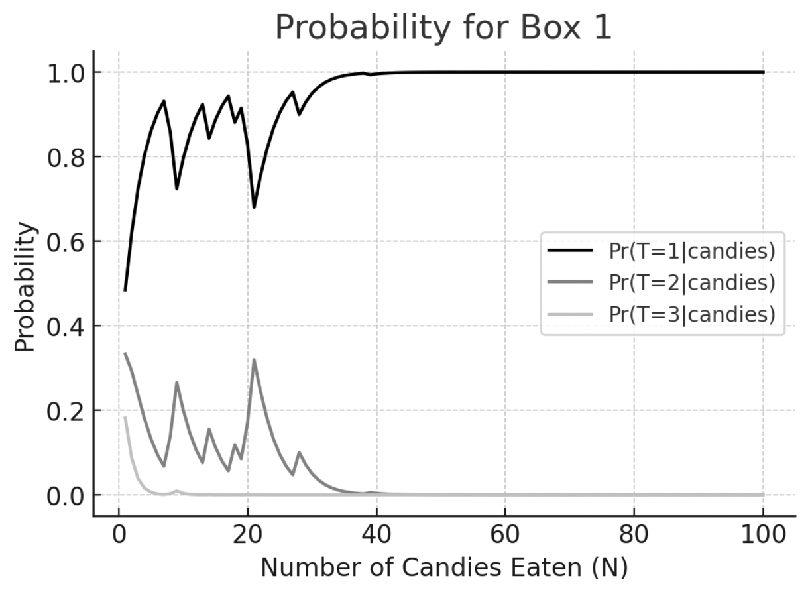
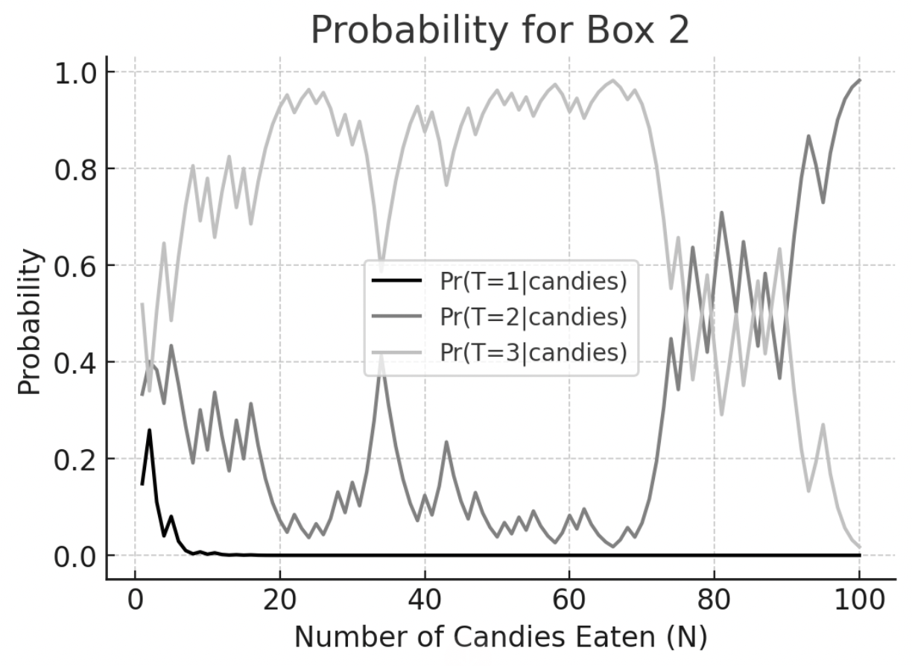
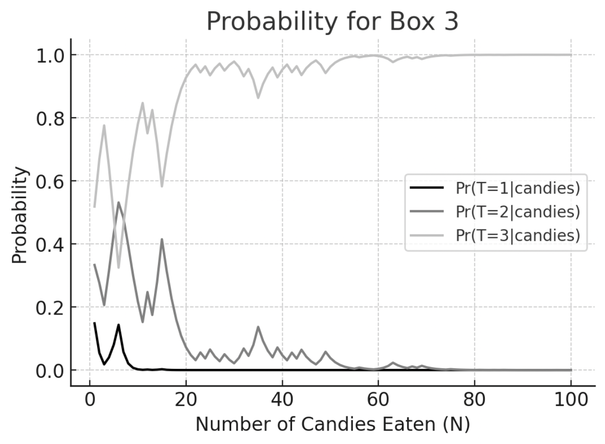
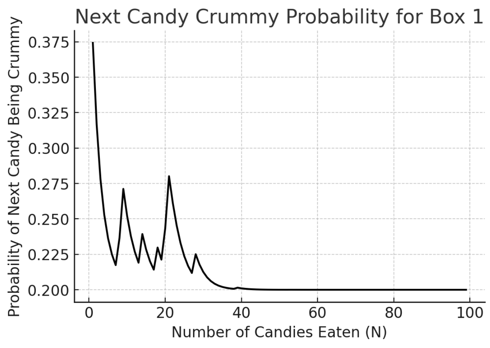
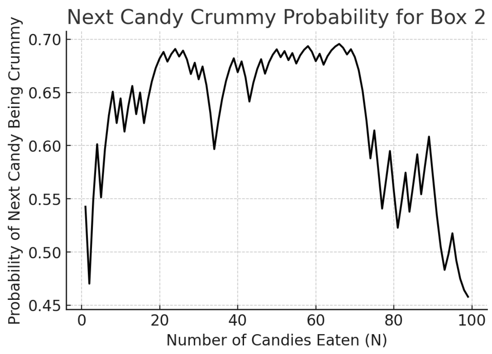
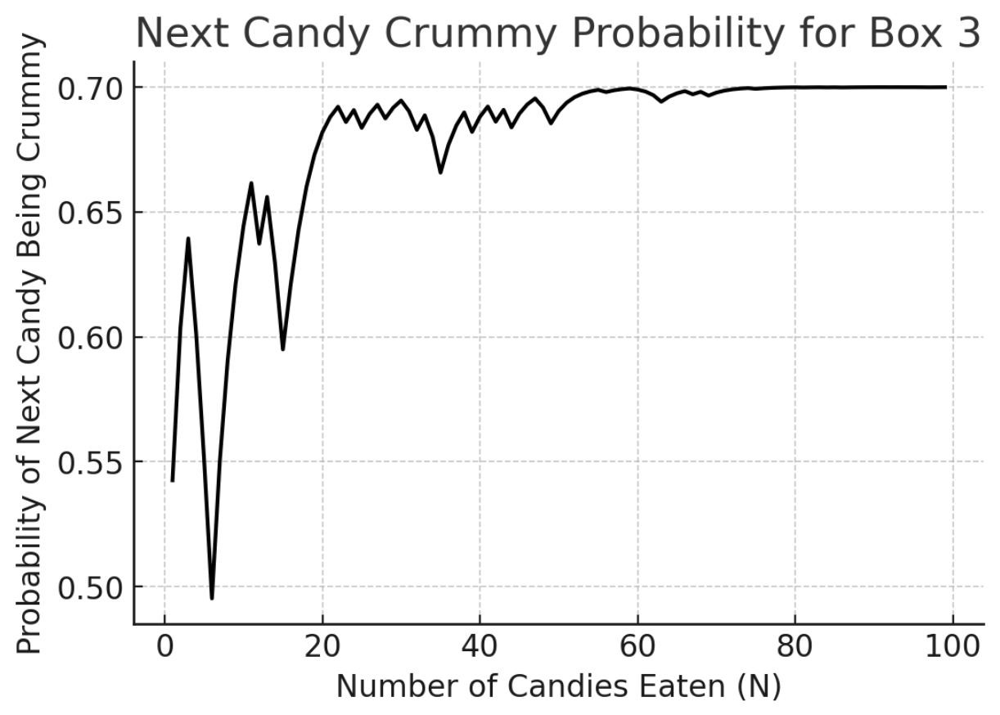
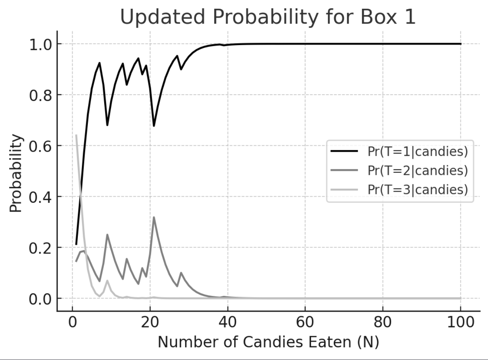
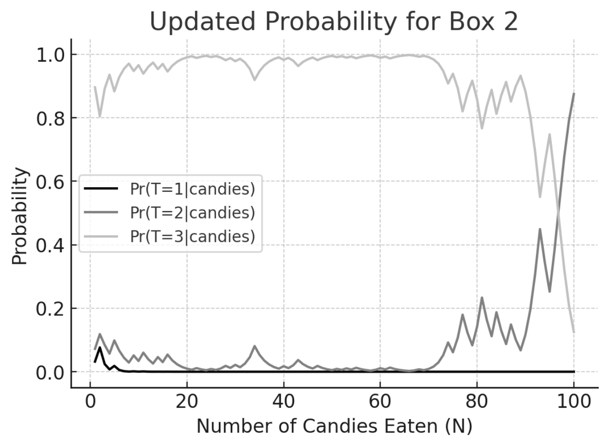
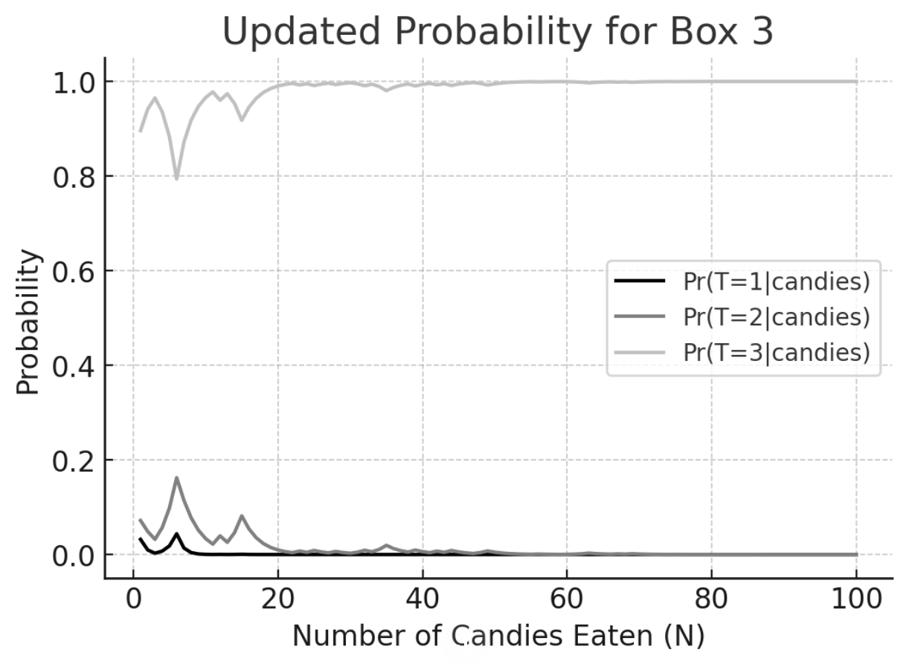

# CSDS440 Written Homework 5
**Instructions:** Each question is worth 10 points unless otherwise stated. Write your answers below the question. Each answer should be formatted so it renders properly on github. **Answers that do not render properly may not be graded.** Please comment the last commit with "FINAL COMMIT" and **enter the final commit ID in canvas by the due date.** 

When working as a group, only one answer to each question is needed unless otherwise specified. Each person in each group must commit and push their own work. **You will not get credit for work committed/pushed by someone else even if done by you.** Commits should be clearly associated with your name or CWRU ID (abc123). Each person is expected to do an approximately equal share of the work, as shown by the git logs. **If we do not see evidence of equal contribution from the logs for someone, their individual grade will be reduced.** 

Names and github IDs (if your github ID is not your name or Case ID): Pranav Dhinakar (pxd222), Jizhe Meng (jxm1280)

1.	Redo the backprop example done in class  with one iteration of gradient descent instead of two iterations of SGD as done in class. Compare the average losses after GD and SGD. Discuss the differences you observe in the weights and the losses. (10 points)

Answer: 

- 2 input examples: $x_{1}, x_{2}$
- 2 hidden units: $h_{1}, h_{2}$
- 1 output unit: $o$
- Initial weights from input-hidden: $w_{ih}$ are all $1$
- Initial weights from hidden-output: $w_{ho}$ are all $1$
- Bias for all layers is initially $0$
- Activation function is sigmoid: $\sigma(x) = \frac{1}{1 + e^{-x}}$
- Derivative of sigmoid: $\sigma'(x) = \sigma(x)(1-\sigma(x))$
- Loss Function is Squared Error Loss: $L = \frac{1}{2}(target - output)^{2}$

We will calculate the weights after the first backpropagation update using the two given examples:

1. $x_{1} = [0,0]:f_{1} = 0$
2. $x_{2} = [0, 1]: f_{2} = 1$

Forward pass on $x_{1}$:

$x_{1}$ is all zeros, the activations of hidden units $h_{1}$ and $h_{2}$ will also be zero regardless of weight value. Therefore, the output unit activation will also be $0$. 

Since the output $o = 0$ and the target of $x_{1}$ is $f_{1} = 0$ there is no error to propagate back, so weights will not change. 

Forward pass on $x_{2}$:
- Input to hidden units: $h_{1} = h_{2} = \sigma(w_{ih}\times x_{2} + b_{h}) = \sigma(1 \times 0 + 1 \times 1 + 0) = \sigma(1)$
- Output of hidden units: $\sigma(1) \approx 0.731$
- Hidden to Output units: $o = \sigma(w_{ho} \times [h_{1},h_{2}] + b_{o}) = \sigma(1 \times 0.731 + 1 \times 0.731 + 0) = \sigma(1.462)$
- Output of output unit: $\sigma(1.462) \approx 0.811$

Loss Calculations:
- $error_{o} = (target - output) = (1 - 0.811) = 0.189$

Backpropagation: 
- Derivative of loss w.r.t output unit: $\frac{\partial L}{\partial o} = (o - target) = (0.811 - 1) \approx -0.189$
- Gradient on output unit $w_{ho}$: $\Delta w_{ho} = \frac{\partial L}{\partial o} \times h = -0.189 \times [0.731, 0.731] \approx [-0.138, -0.138]$
- Error Propagated to hidden units: $error_{h}= error_{o} \times w_{ho} \approx 0.189 \times [1, 1] = [0.189, 0.189]$
- Gradient on hidden unit $w_{ih}$: $\Delta w_{ih} = error_{h} \times x_{2} = [0.189, 0.189] \times [0,1] = [0, 0.189]$

Weight Update: 
- Update hidden to output weights: $w_{ho_{new}} = w_{ho_{old}} - \Delta w_{ho} = [1,1] - [-0.138, -0.138] = [1.138, 1.138]$
- Update input to hidden weights: $w_{ih_{new}} = w_{ih_{old}} - \Delta w_{ih} = [1,1] - [0, 0.189] = [1, 0.811]$
After this first update based on $x_{2}$ as input, the new weights would be:
- $w_{ih} = [1, 0.811]$
- $w_{ho} = [1.138, 1.138]$

Average loss calculation from GD:
$L_{GD} = \frac{1}{2}(1-0.811)^{2} \approx 0.018$

Average Loss calculation from two passes of SGD in Class:
$L_{SGD} = \frac{L_{1} + L_{2}}{2} = \frac{0 + 0.018}{2} = 0.009$

Comparison with GD

Average Loss: 
- After one full pass of (GD), the average loss was \approx 0.018, while in SGD it's 0.009. 
- This difference arises because the GD loss was calculated only on the second example $x_2$, where there was an error. 
- In contrast, SGD's average loss includes the first example $x_1$ which had zero loss.

Weight Updates: 
- In GD, weights are updated after considering all examples, leading to potentially more stable but slower updates. 
- In SGD, weights are updated more frequently, often leading to faster convergence but with more variance in the updates. 
- In this specific case, since the first example $x_{1}$ led to no error, the weights remained unchanged after the first iteration of SGD, unlike in GD where the weights were not updated for $x_1$ as it was not individually processed.

Answer 2-4 with the following scenario. The Bayesian Candy Factory makes a Halloween Candy Box that contains a mix of yummy (Y) and crummy (C) candy. You know that each Box is one of three types: 1. 80% Y and 20% C, 2. 55% Y and 45% C and 3. 30% Y and 70% C. You open a Box and start munching candies. Let the $i^{th}$ candy you munch be denoted by $c_i$. Answer the following questions using a program written in any language of your choice. Generate one Box with 100 candies for each type, and assume a fixed order of munching.
 
2.	For each Box, plot $\Pr(T=i|c_1,\ldots ,c_N)$ on a graph where $T$ represents a type and $N$ ranges from 1 to 100. (You should have three graphs and each graph will have three curves.) (10 points)

Answer:

3.	For each Box, plot $\Pr(c_{N+1}=C|c_1,\ldots ,c_N)$ where $N$ ranges from 1 to 99. (10 points)

Answer:

4.	Suppose before opening a Box you believe that each Box has 70% crummy candies (type 3) with probability 0.8 and the probability of the other two types is 0.1 each. Replot $\Pr(T=i|c_1,…,c_N)$ taking this belief into account for each of the 3 Boxes. Briefly explain the implications of your results. (10 points)

Answer: 

#### Implications of the Results:

1. *For Box Type 1 (80% Yummy, 20% Crummy)*: Despite the high initial belief in the box being Type 3, as you munch through the candies, if they are predominantly yummy, the probability of the box being Type 1 increases significantly. This shows how strong evidence (a high proportion of yummy candies) can override initial beliefs.

2. *For Box Type 2 (55% Yummy, 45% Crummy)*: This box presents a more balanced scenario, and the effect of the initial belief is more pronounced here. The probability of the box being Type 3 remains relatively high for a longer time, but it can still be swayed by the evidence from the candies munched.

3. *For Box Type 3 (30% Yummy, 70% Crummy)*: In this case, the initial high belief in Type 3 aligns with the evidence (high proportion of crummy candies), leading to a strong and persistent belief that the box is indeed Type 3. 

The results illustrate the power of Bayesian updating in incorporating both prior beliefs and new evidence. Even a strong initial belief can be changed by sufficient evidence to the contrary, as seen in the case of Box Type 1. Conversely, when initial beliefs are supported by the evidence, as in Box Type 3, they are reinforced, making the posterior belief even stronger. This demonstrates the interplay between prior knowledge and new information in shaping our understanding and predictions.

5.	For a constrained programming problem $\min_w f(w)$ s.t. $g_i(w) \leq 0, h_j(w)=0$, the generalized Lagrangian is defined by $L(w,\alpha,\beta)=f(w)+\sum_i \alpha_i g_i(w)+ \sum_j \beta_j h_j(w), \alpha_i \geq 0$. A primal linear program is a constrained program of the form: $\min_x c^Tx$ s.t. $Ax \geq b, x \geq 0$ where $T$ represents the transpose. Using the generalized Lagrangian, show that the dual form of the primal LP is $\max_u b^Tu$ s.t. $A^Tu \leq  c, u \geq 0$. (10 points)

Answer:

To derive the dual form of a linear program using the generalized Lagrangian, let's start with the primal linear program :

$$
\min_x c^Tx \quad \text{s.t.} \quad Ax \geq b, x \geq 0
$$

To fit this into the generalized Lagrangian framework, we will rewrite the constraints in the standard form of the constrained optimization problem. Which gives:

$$
g_i(x) = -Ax + b \leq 0
$$

$$
h_j(x) = 0 \quad \text{(there are no equality constraints in the primal LP)}
$$

So, the generalized Lagrangian for this problem is:

$$
L(x, \alpha) = c^Tx - \alpha^T (Ax - b)
$$

Where $\alpha \geq 0$ are the Lagrange multipliers associated with the inequality constraints $Ax \geq b$.

The dual function $q(\alpha)$ is obtained by minimizing the Lagrangian over $x$:

$$
q(\alpha) = \min_x L(x, \alpha) = \min_x \left( c^Tx - \alpha^T (Ax - b) \right)
$$

By rearranging the terms in the Lagrangian, we obtain:

$$
L(x, \alpha) = c^Tx - \alpha^T Ax + \alpha^T b = (c^T - \alpha^T A)x + \alpha^T b
$$

To minimize $L(x, \alpha)$ over $x$, we notice that $L(x, \alpha)$ is linear in $x$. 

This means that if $c^T - \alpha^T A$ has any positive components, $L(x, \alpha)$ can be made arbitrarily small (i.e., go to negative infinity) by setting the corresponding components of $x$ to positive infinity. Remember, $x$ is non-negative. 

Thus, for $q(\alpha)$ to be bounded (and not go to negative infinity), we must have:

$$
c^T - \alpha^T A \leq 0
$$

 Using this constraint, the minimization of $L(x, \alpha)$ over $x$ gives $q(\alpha) = \alpha^T b$, since the term $(c^T - \alpha^T A)x$ becomes zero or negative, and the minimum value is achieved when $x = 0$.

The dual problem is then to maximize $q(\alpha)$ over $\alpha$, subject to the following constraints:

$$
\max_\alpha \alpha^T b \quad \text{s.t.} \quad \alpha^T A \leq c^T, \alpha \geq 0
$$

We can relabel $\alpha$ as $u$ and transpose the inequality. This gives us the dual form of the primal LP:

$$
\max_u b^Tu \quad \text{s.t.} \quad A^Tu \leq c, u \geq 0
$$
 

6.	Suppose $K_1$ and $K_2$ are two valid kernels. Show that for positive $a$ and $b$, the following are also valid kernels: (i) $aK_1+bK_2$ and (ii) $aK_1K_2$, where the product is the Hadamard product: if $K=K_1K_2$ then $K(x,y)=K_1(x,y)K_2(x,y)$. (10 points)

Answer:

From lecture 21, we will use Mercer’s Conditions by proving kernel matrix is symmetric and positive semidefinite.

(i) $𝑎𝐾_1 + 𝑏𝐾_2$

For all finite ${x_1, x_2,... x_m}$, the kernel is a linear combination of two valid kernels with positive constants $a$ and $b$. 

The sum of two symmetric matrices is symmetric, since the sum reflect that $K(x,y)=K(y,x)$ doesn't matter position. And the sum of two positive semidefinite matrices is also considered positive semidefinite especially when scaled by positive constants a and b. Now we confirmed $aK_1+bK_2$ is a vaild knernel by proving its kernel matrix is symmetric and positive semidefinite.

(ii) $𝑎𝐾_1𝐾_2$ (Hadamard product)

For all finite ${x_1, x_2,... x_m}$, the (Hadamard) product is an element-wise multiplication.

The product'symmetry of $K_1 K_2$ ensures that $K(x,y)=K_1(x,y)K_2(x,y)=K_1(y,x)K_2(y,x)=K(y,x)$, so $K$'s kernel matrix is symmetric. Because the Hadamard product of two positive semidefinite matrices is positive semidefinite, so $K$'s kernel matrix is also positive semidefinite. Now we confirmed $𝑎𝐾_1𝐾_2$ is a vaild knernel by proving its kernel matrix is symmetric and positive semidefinite.

7.	Define $K(x,y)=(x\cdot y+c)^2$, where $c$ is a positive constant and $x$ and $y$ are $n$-dimensional vectors. Show that K is a valid kernel by finding $\phi$ so that $K= \phi(x)\cdot \phi(y)$. (10 points)

Answer:

Showing $K$ is a Valid Kernel. Dimension =$ \sqrt 2$:

First, we defind $\phi(x) = [c, \sqrt {2c}x_1, \sqrt {2c}x_2, x_1^2, x_2^2, \sqrt2x_1x_2]$.

Then we calculate $\phi(x) \times \phi(y) = c + 2cx_1y_1 + 2cx_2y_2 + x_1^2y_1^2 + x_2^2y_2^2 + 2x_1x_2y_1y_2$

Now we calculate $K(x,y)=(x\cdot y+c)^2$, $K(x,y)=(x\cdot y+c)^2= c + 2cx_1y_1 + 2cx_2y_2 + x_1^2y_1^2 + x_2^2y_2^2 + 2x_1x_2y_1y_2 = \phi(x) \times \phi(y)$

Since $K(x,y)=(x\cdot y+c)^2$ can be represented as the dot product of $\phi(x) \times \phi(y)$, kernel $K$ can be confirmed as a valid kernel by finding $\phi$ so that $K= \phi(x)\cdot \phi(y)$.

8.	Define $K(x,y)=(x\cdot y+c)^2$, where $c$ is a positive constant and $x$ and $y$ are $n$-dimensional vectors. Show that $K$ is a valid kernel by showing that it is symmetric positive semidefinite. (10 points)

Answer:

From lecture 21, we will use Mercer’s Conditions by proving kernel matrix is symmetric and positive semidefinite.

We have $K(x,y)=(x\cdot y+c)^2$, now we reverse x and y we get $K(y,x)=(y\cdot x+c)^2$.

Since $K(x,y)=(x\cdot y+c)^2=(y\cdot x+c)^2=K(y,x)$, we can prove $K$'s kernel matrix is symmetric with $(x\cdot y)$ is commutative because of the same product (different order).

For all finite ${x_1, x_2,... x_m}$, we can see that all K's eigenvalues are non-negative because $(x\cdot y+c)^2$ is a suqare (non-negative), and sum of non-negative (real) numbers also non-negative, so $K$'s kernel matrix is positive semidefinite.

Now we confirmed $K$ is a vaild knernel by proving its kernel matrix is symmetric and positive semidefinite.

9.	Show with an example that an ensemble where elements have error rates worse than chance may have an overall error rate that is arbitrarily bad. (10 points)

Answer:

For example, we need to make the decision true/false, for the chance(p) to make decision randomly, the chance is 0.5.

Now we suppose the elements have error rate = 0.75, and we make the final decision by the decisions of multiply odd num of elements, the decision made by majority voting scheme.

For this example we have 3 elements, if 2 or more elements make same decision, that is the final decision. 

$P_{ensembleerror}=P(2errors)+P(3errors)$

$P=\binom{3}{2}\times0.75^2\times0.25+\binom{3}{3}\times(0.75^3)=0.844$

This significantly higher than 50%(chance) and 75%(error rate).

To test the solution we try another error rate=0.6:

$P=\binom{3}{2}\times0.6^2\times0.4+\binom{3}{3}\times(0.6^3)=0.648$

This significantly higher than 50%(chance) and also higher than 60%(error rate).

10.	Suppose an ensemble of size 100 has two types of classifiers: $k$ “good” ones with error rates equal to 0.3 each and $m$ “bad” ones with error rates 0.6 each ( $k + m = 100$ ). Examples are classified through a majority vote. Using your favorite software/language, find a range for $k$ so that the ensemble still has an error rate < 0.5. Commit your code in W5Q10.[extension].  (10 points)

Answer:

Suppose the specified error rates are uncorrelated. The result shows that it's not possible to form an ensemble that performs better than random chance(0.5) with a range of k. Also means there is no value of 
$k$ (number of "good" classifiers with a 0.3 error rate) in an ensemble of 100 classifiers that would lead the ensemble having an error rate less than 0.5 when the errors are uncorrelated.

All done\!
