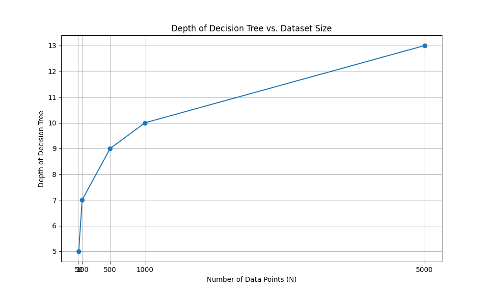
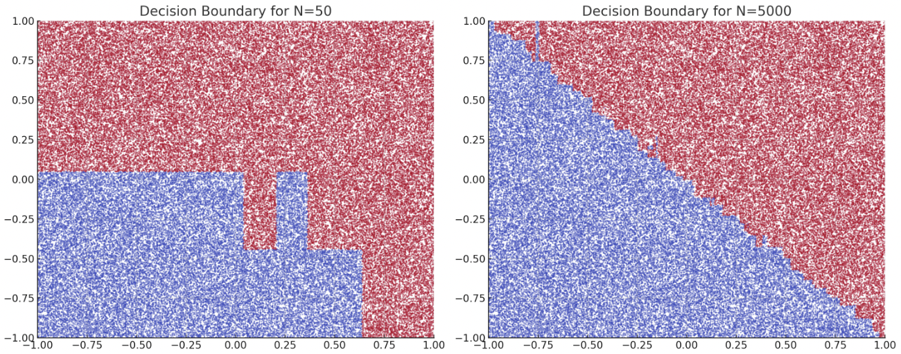

# CSDS440 Written Homework 2
**Instructions:** Each question is worth 10 points unless otherwise stated. Write your answers below the question. Each answer should be formatted so it renders properly on github. **Answers that do not render properly may not be graded.** Please comment the last commit with "FINAL COMMIT" and **enter the final commit ID in canvas by the due date.** 

When working as a group, only one answer to each question is needed unless otherwise specified. Each person in each group must commit and push their own work. **You will not get credit for work committed/pushed by someone else even if done by you.** Commits should be clearly associated with your name or CWRU ID (abc123). Each person is expected to do an approximately equal share of the work, as shown by the git logs. **If we do not see evidence of equal contribution from the logs for someone, their individual grade will be reduced.** 

1.	(i) Give an example of a nontrivial (nonconstant) Boolean function over $3$ Boolean attributes where $IG(X)$ would return zero for *all* attributes at the root. (ii) Explain the significance of this observation. 

Answer:
(i) Let us consider a Boolean function where2
$F(A,B,C) = (A \ AND \ B) \ OR \ (NOT \ A \ AND \ NOT \ B) \ OR \ (NOT \ C)$
 Here in this function OR computes three terms, one where A and B are true, while in the next one both are not true and in the last C is not true. In this function we have deliberately designed it so that the information gain for attributes B and C will be 0 when used as a root attribute.
 
 1. Information Gain for $A$:
First, we are getting an original dataset (D) and since each attribute can take 2 values(T or F), there are $2^{3} = 8$ combinations. Also, the dataset is divided in two, D1 and D2 where $A$ is true and false respectively.

 Entropy of the original dataset $H(D)$,
 
 $H(D) = -P(\frac{0}{D})log_{2}(P(\frac{0}{D}))-P(\frac{1}{D})log_{2}(P(\frac{1}{D}))$
 $= \frac{-4}{8} log_{2}(\frac{4}{8}) - \frac{4}{8} log_{2}(\frac{4}{8})$
 $= -0.5(-1) -0.5(-1)$
 $= 0.5+0.5 = 1$
 
 So, D1 contains (1,1,0),(1,0,0),(1,1,1),(1,0,1).
 
 $P(\frac{0}{D1}) = \frac{1}{4}$
 
 $P(\frac{1}{D1}) = \frac{3}{4}$
 
 Entropy for D1: 
 
$H(D1) = \frac{-1}{4} log_{2} (\frac{1}{4}) - \frac{3}{4} log_{2} (\frac{3}{4}) ≈ 0.8113$

 now, D2 contains (0,1,0),(0,0,0),(0,1,1),(0,0,1).
 
 $P(\frac{0}{D2}) = \frac{1}{4}$
 
 $P(\frac{1}{D2}) = \frac{3}{4}$
 
 Entropy for D2:
 
 $H(D2) = \frac{-1}{4} log_{2}(\frac{1}{4}) - \frac{3}{4}log_{2}(\frac{3}{4}) ≈ 0.8113$
	  
 Now, information gain for $A$ is,
 
 $IG(A) = H(D) - (\frac{4}{8}*0.8113 + \frac{4}{8}*0.8113)$
 $= 1 - 0.8113 ≈ 0$

 2. Information Gain for $B$:
Here the entropy for D1 and D2 are the same as when calculating $IG(A)$.

So, $H(D1) ≈ 0.8113$
$H(D2) ≈ 0.8113$

Therefore, $IG(B) = H(D) - (\frac{4}{8}*0.8113 + \frac{4}{8}*0.8113) ≈ 0$

 3. Information Gain for $C$:
Here, D1 contains (0, 0, 1), (1, 1, 1), (0, 1, 1), (1, 0, 1). 

$P(\frac{0}{D1}) = \frac{1}{2}$

$P(\frac{1}{D1}) = \frac{1}{2}$

Entropy for D1: 

$H(D1) = \frac{-1}{2} log_{2} (\frac{1}{2}) - \frac{1}{2} log_{2} (\frac{1}{2}) = 1$

now, D2 contains (1, 1, 0), (0, 0, 0), (1, 0, 0), (0, 1, 0).
Entropy for D2:

$P(\frac{0}{D2}) = \frac{1}{2}$

$P(\frac{1}{D2}) = \frac{1}{2}$

Entropy for D2: 

$H(D2) = \frac{-1}{2} log_{2} (\frac{1}{2}) - \frac{1}{2} log_{2} (\frac{1}{2}) = 1$

Now, information gain for C is,

$IG(C) = H(D) - (\frac{4}{8}*1 + \frac{4}{8}*1)$
$= 1 - (0.5+0.5) = 0$

(ii)
 The significance of the observation is that for the given Boolean function and dataset, attributes A,B and C have IG(X) = 0 when used as root attributes for a decision tree. So in this specific context, none of these attributes provide any advantage in reducing uncertainty of separating data. The balanced distribution of the outcomes in the dataset H(D) =1 makes all attributes equally ineffective as root attributes for decision tree split.

2. Estimate how many functions satisfying Q1 (i) could exist over $n$ attributes, as a function of $n$. 

Answer:
- If for a given boolean function of $n$ attributes to have an $IG(Y|X=x_{i}) = 0$ $\forall X$ being any given attribute of the function. Each attribute $X$ must partition the set of attribute-value combinations into the same ratio of 0 and 1 labels as there are in the unpartitioned set of labels. 
- Meaning that for any given attribute of the boolean function, the entropy of that attribute with respect to the labels must equal the entropy of the labels itself. $H(Y| X) = H(Y) \rightarrow IG(Y|X) = H(Y) - H(Y|X) = 0$ .
- A relevant case in which the above statement can hold is when there is an exact $50/50$ split between all positive and negative labels. And the partitioning of the label set for each attribute $X$ also results in an exact $50/50$ split between positive and negative labels. 
- Therefore: $H(Y) = 1$ and $H(Y|X) = 1 \rightarrow IG(Y|X) = 1-1 = 0$
- From this case we can derive a method of generating functions that satisfy the requirements laid out in problem one. From this method we can extrapolate the number of possible functions over $n$ boolean attributes. 

Consider this table of boolean attributes:

| A | B | C | Value |
|---|--- |---|---|
| 0 | 0 | 0 | T |
| 0 | 0 | 1 | F |
| 0 | 1 | 0 | F |
| 0 | 1 | 1 | T |
| --|---|---|---|
| 1 | 0 | 0 | T |
| 1 | 0 | 1 | F |
| 1 | 1 | 0 | F |
| 1 | 1 | 1 | T |

What stands out in this table is the symmetry between the set of labels at the top half of the table and the bottom half. A way of constructing such a table logically is to take the assigned label of each row and give the *complimentary row* the same assignment. 

E.G: 
$row \ 2 = {0, 0, 1}, \ label \ 2 = {F}$

$(row \ 2)' = row \ 5 = {1, 1, 0}, \ label \ 5 = {F}$

As you can see above, the two complimentary rows share the same label. Extend this constraint to all other rows in the table and you will have a dataset with an Information gain of $0$ for all boolean attributes. 

Steps:
- Create a table of all possible boolean attribute combinations this generates a table with $2^{n}$ number of rows.
- Now divide your set in half such that for each row, the compliment of that row is not within the same half of the table. This results in two halves of size $\frac{2^{n}}{2} = 2^{n-1}$ 
- For one of the two sets assign each row a label such that there is an equal number of positive and negative labels in the set. Then for each complimentary row in the second set assign the same label.
- We only need to assign labels for half of our dataset, as the complimentary rows and their corresponding labels can be trivially inferred. Now the number of possible unique tables that can be made from this method is the number of unique ways we can assign our binary labels to the first half of the table. Therefore *No. of unique functions* = $2 ^ {2^{n-1}} = 2^{2n-2}$ 
 
3.	Show that for a continuous attribute $X$, the only split values we need to check to determine a split with max $IG(X)$ lie between points with different labels. (Hint: consider the following setting for $X$: there is a candidate split point $S$ in the middle of $N$ examples with the same label. To the left of $S$ are $n$ such examples. To the left of $N$, there are $L_0$ examples with label negative and the $L_1$ positive, and likewise $(M_0, M_1)$ to the right. Express the information gain of $S$ as a function of $n$. Then show that this function is maximized either when $n=0$ or $n=N$ with all else constant.) (20 points)

Answer:
Visualization of label set
|-----|-----|-----|-----|-----|-----|-----|
$L_{0}$    $L_{1}$      $n$       $S$   $N-n$   $M_{0}$   $M_{1}$

It is known that $IG(Y|X) = H(Y) - H(Y|X)$

Since $H(Y)$ remains constant for any value of $n$ we can state that the $IG(Y|X)$ increases as $H(Y|X)$ increases.

If we want to maximize the $IG(Y|X)$ we will want to minimize $H(Y|X)$.

Entropy equation of the continuous attribute $X$

$$
H(Y|X) = P(X \leq S)H(Y|X \leq S) + P(X > S)H(Y|X > S)
$$

Break down of terms and their dependencies

Probability attribute is less than or equal to split $S$

$P(X \leq S) = \frac{L_{0} + L_{1} + n}{L_{0} + L_{1} + N + M_{0} + M_{1}}$ 

Probability attribute is greater than split $S$

$P(X > S) = \frac{M_{0} + M_{1} + N-n}{L_{0} + L_{1} + N + M_{0} + M_{1}}$ 

Probabilities for whether the label is positive or negative given the attribute is less than or equal to the split

$P^{-}(X \leq S) = (\frac{L_{0}}{L_{0} + L_{1} + n})$

This is working now for whatever reason

$P^{+}(X \leq S) = (\frac{L_{1}}{L_{0} + L_{1} + n})$

Entropy of the label w.r.t the attributes less than or equal to split $S$

$$
H(Y|X \leq S) = -P^{-}(X \leq S)\log_{2}(-P^{-}(X \leq S)) - P^{+}(X \leq S) \log_{2}(P^{+}(X \leq S))
$$

$\rightarrow \frac{L_0}{n+L_0+L_1} log_2(\frac{n+L_0+L_1}{L_0}) + \frac{n+L_1}{n+L_0+L_1} log_2(\frac{n+L_0+L_1}{n+L_1})$

Probabilities for whether the label is positive or negative given the attribute is greater than the split

$P^{-}(X > S) = (\frac{M_{0}}{M_{0} + M_{1} + N-n})$

This is working now for whatever reason

$P^{+}(X > S) = (\frac{M_{1}}{M_{0} + M_{1} + N-n})$

Entropy of the label w.r.t the attributes greater than split $S$

$$
H(Y|X > S) = -P^{-}(X > S)\log_{2}(-P^{-}(X > S)) - P^{+}(X > S) \log_{2}(P^{+}(X > S))
$$

$\rightarrow \frac{M_0}{N-n+M_0+M_1} log_2(\frac{N-n+M_0+M_1}{M_0}) + \frac{N-n+M_1}{N-n+M_0+M_1} log_2(\frac{N-n+M_0+M_1}{N-n+M_1})$

In order to calculate total entropy we need the following two terms for the equation:
$P(X \leq S)H(Y|X \leq S) = \frac{L_{0} + L_{1} + n}{L_{0} + L_{1} + N + M_{0} + M_{1}} \times [\frac{L_0}{n+L_0+L_1} log_2(\frac{n+L_0+L_1}{L_0}) + \frac{n+L_1}{n+L_0+L_1} log_2(\frac{n+L_0+L_1}{n+L_1})]$
and
$P(X > S)H(Y|X > S) = \frac{M_{0} + M_{1} + N-n}{L_{0} + L_{1} + N + M_{0} + M_{1}} \times [\frac{M_0}{N-n+M_0+M_1} log_2(\frac{N-n+M_0+M_1}{M_0}) + \frac{N-n+M_1}{N-n+M_0+M_1} log_2(\frac{N-n+M_0+M_1}{N-n+M_1})]$

Since we want to minimize $H(Y|X)$ in order to maximize $IG(Y|X)$ we will need the first and second derivative of this function to perform any sort of optimization. 

$\frac{d}{dn}H(Y|X) = \frac{d}{dn}P(X \leq S)H(Y|X \leq S) + \frac{d}{dn}P(X > S)H(Y|X > S)$

$\frac{d}{dn}P(X \leq S)H(Y|X \leq S) = \frac{ln(\frac{n+L_1+L_0}{n+L_1})}{ln(2)(N+M_1+M_0+L_1+L_0)}$

$\frac{d}{dn}P(X > S)H(Y|X > S) = -\frac{ln(\frac{-n+N+M_1+M_0}{-n+N+M_1})}{ln(2)(N+M_1+M_0+L_1+L_0)}$

$\frac{d}{dn}H(Y|X) = \frac{ln(\frac{n+L_{1}+L_{0}}{n+L_{1}})}{ln(2)(N+M_{1}+M_{0}+L_{1}+L_{0})} - \frac{ln(\frac{-n+N+M_1+M_0}{-n+N+M_1})}{ln(2)(N+M_1+M_0+L_1+L_0)}$

$\rightarrow \frac{ln(\frac{n+L_{1}+L_{0}}{n+L_{1}}) - ln(\frac{-n+N+M_1+M_0}{-n+N+M_1})}{ln(2)(N+M_1+M_0+L_1+L_0)}$

To determine local maxima and minima of a function the second derivative of our entropy function is required. 

$\frac{d^{2}}{dn^{2}}H(Y|X) = \frac{\frac{(n+L_1)(\frac{1}{n+L_1}-\frac{n+L_1+L_0}{(n+L_1)^2})}{n+L_1+L_0}-\frac{(N-n+M_1)(\frac{N-n+M_1+M_0}{(N-n+M_1)^2}-\frac{1}{N-n+M_1})}{N-n+M_1+M_0}}{ln(2)(N+M_1+M_0+L_1+L_0)}$

The above function can be 'simplified' to the function below

$\rightarrow \frac{d^{2}}{dn^{2}}H(Y|X) = \frac{\frac{1-\frac{n+L_1+L_0}{n+L_1}}{N+L_1+L_0} - \frac{\frac{N-n+M_1+M_0}{N-n+M_1}-1}{N-n+M_1+M_0}}{ln(2)(N+M_1+M_0+L_1+L_0)}$

The two terms in the numerator of the above function can tell us quite a lot about the behavior of $n \in [0, N]$.

FIRST TERM:
$$\frac{1-\frac{n+L_1+L_0}{n+L_1}}{N+L_1+L_0}$$
This component:

$\frac{n+L_1+L_0}{n+L_{1}} < 1$

So the above term *will always be a negative number* for any $n \in [0,N]$

SECOND TERM:
$$\frac{\frac{N-n+M_1+M_0}{N-n+M_1}-1}{N-n+M_1+M_0}$$
This component:

$\frac{N-n+M_1+M_0}{N-n+M_1} > 1$

So the above term *will always be a positive number* for any $n \in [0,N]$

Since the first term of the numerator in our equation for $\frac{d^{2}}{dn^{2}}H(Y|X)$ is always positive and the second term is always positive. The numerator of our function will always be a negative number for all $n \in [0,N]$. The denominator of our function will always be positive as $\ln(2)(N + M_{1} + M_{0} + L_{1} + L_{0}) > 0$. So our whole secondary derivative function *will always be negative*.

Since the second derivative of $H(Y|X)$ is always negative our entropy function is *concave down*. Our values for $n \in [0, N]$ will all be local minima. And one of the endpoints $n = 0 \ or \ n = N$ will be the *global minimum* of the whole function. 

So in order to minimize the entropy $H(Y|X)$ and therefore maximize the information gain $IG(Y|X)$, $n$ would need to be either $n = 0 \ or \ n = N$. This means that *we have shown that the best possible place to split the dataset is when the label changes* which occurs at $n = 0$ or $n = N$.

4.	Write a program to sample a set of $N$ points from $(−1,1)^2$. Label the points using the classifier $y=sign(0.5x_1+0.5x_2)$. Generate datasets from your program and use your ID3 code from Programming 1 to learn trees on this data (there is no need to do cross validation or hold out a test set). Plot a graph where the $x$-axis is the value of $N$, over $N={50, 100, 500, 1000, 5000}$, and the $y$-axis is the depth of the tree learned by ID3. Explain your observations. (20 points)

Answer: 

Observations: 
- As the size of the dataset we are training on increases the depth of our tree generally increases as well. This is due to the increase in the number of splits available for our tree to adopt. 
- However the relationship between the size of our dataset and the depth of our tree does not appear to be linear. Rather the relationship appears to be more logarithmic. 
- A supporting observation for the above claim is that the increase in tree depth between $N = 500$ and $N = 1000$ is relatively small compared to the increase $N = 100$ and $N = 500$. 

5.	Show the decision boundaries learned by ID3 in Q4 for $N=50$ and $N=5000$ by generating an independent test set of size 100,000, plotting all the points and coloring them according to the predicted label from the $N=50$ and $N=5000$ trees. Explain what you see relative to the true decision boundary. What does this tell you about the suitability of trees for such datasets? (20 points)

Answer: 

Observations: 
- The true decision boundary (from the classifier $y=sign(0.5x_{1}+0.5x{2}$) is a straight line passing through the origin with a slope of 1. This is essentially the line $x_{1}=x_{2}$​.
- *N = 50*: The decision boundary appears to be a piecewise constant approximation of the true decision boundary. This is typical for decision trees, especially when the dataset size is small. The tree makes axis-aligned splits, resulting in these rectangular regions.
- *N=5000*: With more data, the decision tree's boundary seems to approximate the true boundary more closely, but it's still a piecewise constant approximation. If you look closely you can see how jagged the 'line' dividing the two region of points is. 

*What this tells us about Decision Trees*:
- Decision trees produce *axis-aligned* splits. This is evident from the rectangular region of the low depth trees, trained boundary. For datasets where the boundaries aren't axis-aligned like the one above, decision trees won't be the most efficient model. 
- *Overfitting* is evident in the second image. There are regions where our boundary jumps suddenly to seemingly cater towards certain specific datapoints. Overfitting is a problem that we encounter with high depth trees. 

6.	Under what circumstances might it be beneficial to overfit? 

Answer:
 Since it results in poor generalization, overfitting is typically viewed as a concern in statistical modeling and machine learning. Overfitting, however, may be advantageous or at the very least acceptable when you want the model to be susceptible to rare and unusual patterns or to help with anomaly detection.
 Secondly, when we have a very small dataset, it will be challenging to train a model that generalizes well, so in those cases, some level of overfitting may help the model capture the limited information available.
 Third, when your data contains a high level of noise or measurement errors then a more complex model with some level of overfitting may capture both the signal and noise. Though this might not help with generalization, it might provide better results with noisy data.

