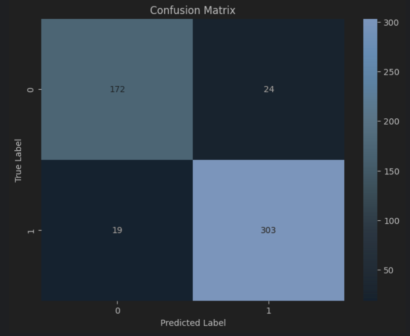
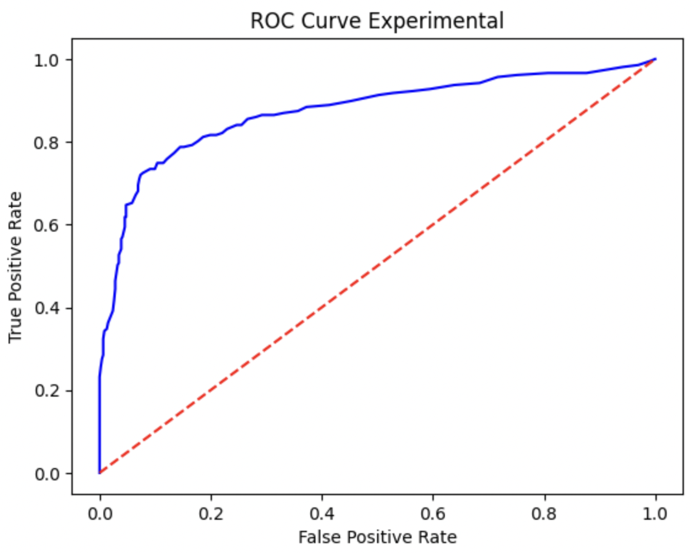
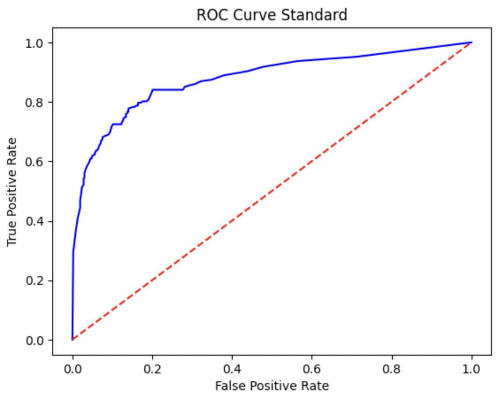
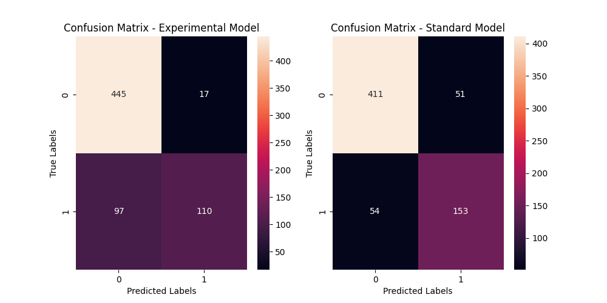
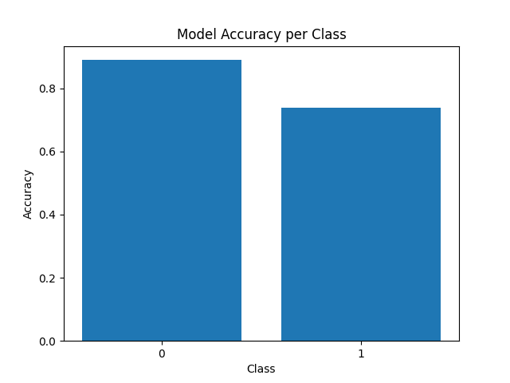
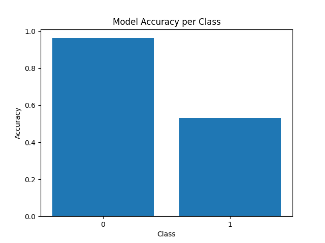

## CSDS440 Group 2 Project

Names and github IDs: Pranav Dhinakar (pxd222), Jizhe Meng (jxm1280), Samuel Lovvoll (sdl74), Ritu Havaldar (rah215)

Seed Paper: [Semi-Supervised Learning. Xiaojin Zhu. Semi-Supervised Learning Literature Survey. Computer Sciences TR 1530. University of Wisconsin Madison](/ssl_survey.pdf)

-----
## **1. Methods**
-----

-----
## **1.1 Combining Gaussian Mixture Model (GMM) and Autoencoder for Anomaly Detection**

[Direct to Jizhe Meng's report](/jxm1280/Jizhe_Meng_Project_Report.md)

In my project, I implemented three different semi-supervised models to detect anomalies in credit card transactions. These models were:

1. Gaussian Mixture Model (GMM)
1. One-Class SVM (Support Vector Machine)
1. Autoencoders

I used a dataset containing transactions from European cardholders in September 2013, which included a mix of both normal and fraudulent transactions.

Model Implementations

1. **Gaussian Mixture Model (GMM):**
   1. **Preprocessing:** StandardScaler was used to standardize features.
   1. **Training:** The model was trained on a dataset consisting only of normal transactions.
   1. **Log Likelihood Scores:** Used to determine how well each transaction fit the model’s understanding of “normal” behavior.
   1. **Threshold Determination:** Precision, recall, and F2 scores across various thresholds were calculated to find the optimal threshold for classifying transactions.
1. **One-Class SVM:**
   1. **Model Setup:** Initialized with a Gaussian kernel and trained exclusively on normal transactions.
   1. **Anomaly Detection:** Predicted labels for the test set based on the distance from the decision boundary.
1. **Autoencoders:**
   1. **Architecture:** Designed with an encoding dimension of 14 and trained to reconstruct normal transactions.
   1. **Reconstruction Error:** Used to detect anomalies, where a high mean squared error indicated an outlier.

Model Evaluation and Results

1. **GMM Results:**
   1. Achieved perfect recall (100%), but extremely low precision (0.1738%).
   1. Identified all fraudulent transactions in the test set but incorrectly flagged many normal transactions as fraudulent.
1. **One-Class SVM Results:**
   1. Showed high precision for normal transactions (98%) but very low precision and recall for fraudulent transactions (both 0%).
1. **Autoencoder Results:**
   1. Demonstrated high recall (91%) for fraudulent transactions.
   1. Better precision than GMM, but still flagged a significant number of normal transactions as fraudulent.

For research extension, I Combined GMM and Autoencoder for Enhanced Detection

I explored combining GMM and Autoencoders to improve anomaly detection. This involved:

- **Feature Compression with Autoencoder:** Training an Autoencoder on normal transactions to learn a compact representation.
- **Data Transformation:** The encoder part of the Autoencoder transformed the entire dataset into a lower-dimensional feature space.
- **Anomaly Clustering with GMM:** A GMM was trained on the encoded data to classify transactions based on cluster probabilities.
- **Anomaly Detection:** Combined the reconstruction error from the Autoencoder with GMM cluster probabilities for classification.

Comparative Analysis and Conclusion

- The standalone GMM model had high recall but was operationally inefficient due to low precision.
- One-Class SVM showed moderate recall but was ineffective due to many false positives.
- The Autoencoder alone provided a better balance between recall and precision.
- The combined GMM and Autoencoder approach showed significant potential, improving recall rates and providing a foundation for reducing false positives.
- This synergy could be key to advancing fraud detection methodologies, offering more nuanced detection capabilities and adaptability to various types of fraud.

-----
## **1.2 Debiased Self-Training for Semi-Supervised Learning**

[Direct to Pranav Dhinkar's report](/pxd222/Pranav_Dhinkar_Report.md)
File Location: /pxd222/code/DST.ipynb

In this project, I explored the Debiased Self-Training (DST) approach, aiming to address biases in self-training processes in semi-supervised learning. The key highlights of the project are:

1. **Problem Identification and Analysis:**
   - Identified and analyzed biases arising from self-training, notably the discrepancy between pseudo and actual labels.

2. **Debiased Self-Training (DST) Approach:**
   - DST addresses these biases through two novel strategies. Only Adversarial Optimization was implemented in my exploration of the techniques:
     1. **Decoupling Pseudo Label Generation and Utilization:** Ensures the generation and use of pseudo labels are independent, reducing error accumulation.
     2. **Adversarial Optimization:** Focuses on improving the quality of pseudo labels by optimizing representations to avoid worst-case scenarios of self-training bias.

3. **Experiments and Results:**

4. **Conclusion and Future Directions:**
   - DST presents a significant advancement in semi-supervised learning by effectively reducing biases, showcasing potential for broader application and further research in enhancing machine learning models' accuracy and reliability.

-----
## **1.3 Sam Lovvoll Self-Training and Co-Training Wrapper Algorithms**

[Direct to Sam Lovvoll's report](/sdl74/Sam_Lovvoll_Project_Report.md)

I implemented 2 methods and 1 research extension
## Method 1: Self-Training:
The SelfTrain class is a semi-supervised binary self-training classifier. When fitting to data, the model first trains on all labeled datapoints, then attempts to classify the unclassified datapoints. Depending on input, the algorithm will either choose the k best unlabeled points to give pseudo-labels, or will choose all points above a certain threshold confidence to give pseudo-labels. These newly labeled points will be added to the training set and a new iteration of the algorithm will start. This continues until either no points are added or there are no more unlabeled datapoints. The confidence is taken from predict_proba, a method inherited from the input model
## Method 2: Co-Training:
The CoTrain class is a semi-supervised binary co-training classifier. When fitting to data, first, each individual classifier learns the labeled data, then predicts all the unlabeled examples. Of n classifiers, if >= n-1 of them agree on a label, it is added to the labeled dataset with a pseudo-label.
## Research Extension 1: Multi-View Co-Training:
Co-Training works because classifiers are independent, so the confidence of one classifier can boost another classifier. In the base Co-Training model, this independence is achieved by using different base classifiers, but it is also possible to achieve independence by providing the same classifier with a different "view" of the data. A view is a subset of the features. The nontrivial part of the research extension is finding a split for the views where they are independent and still contain useful information about the label. Some features can contain redundant information, so it's important to make sure the features that share information are on the same side of the split.

-----
## **1.4**

[Direct to Ritu Havaldar's report](/rah215/Ritu_Havaldar_Project_Report.md)

-----
## **2. Results, Analysis and Discussion**
-----
For comparing our algorithms, we chose [breast_cancer](https://scikit-learn.org/stable/datasets/toy_dataset.html) from toy dataset.

-----
## **2.1 Combining Gaussian Mixture Model (GMM) and Autoencoder**

For this part, we have the result from supervised learning / labeled data:

Precision: 0.8414634146341463

Recall: 0.971830985915493

F1 Score: 0.9019607843137255

F2 Score: 0.942622950819672

Comparing the result from the semi-supervised method. we got:

Precision: 0.6893203883495146

Recall: 1.0

F1 Score: 0.8160919540229885

F2 Score: 0.917312661498708

## **2.2 Self Training Performance

Precision: 0.9629

Recall: 0.5446

-----

## **2.3 Debiased Self-Training for Semi-Supervised Learning**

| Metric                                      | Value                |
|---------------------------------------------|----------------------|
| Accuracy of Generator on Validation Dataset | 57.58%               |
| Worst-Case Bias                             | 0.4545454545454546   |
| **Validation Accuracy (Iteration-wise)**    |                      |
| Iteration 1                                 | 90.15%               |
| Iteration 2                                 | 93.94%               |
| Iteration 3                                 | 93.94%               |
| Iteration 4                                 | 93.94%               |
| Iteration 5                                 | 92.42%               |
| **Standard Training Validation Accuracy**   |                      |
| Iteration 1                                 | 56.82%               |
| Iteration 2                                 | 57.58%               |
| Iteration 3                                 | 81.82%               |
| Iteration 4                                 | 90.91%               |
| Iteration 5                                 | 92.42%               |
| **Experimental Model Metrics**              | True Positives: 73,  |
|                                             | False Negatives: 2,  |
|                                             | False Positives: 8,  |
|                                             | True Negatives: 49   |
| **Standard Model Metrics**                  | True Positives: 73,  |
|                                             | False Negatives: 2,  |
|                                             | False Positives: 8,  |
|                                             | True Negatives: 49   |

ROC Curves:

Confusion Matrices:

Model Accuracies Across Classes

Experimentally Trained Model Accuracy 

Standard Trained Model Accuracy 

-----
## **2.5 Comparing Methods Across the Group Members**

### Key Findings
- **Anomaly Detection (Jizhe Meng)**: The combination of GMM and Autoencoders showed promise in improving recall rates and reducing false positives, outperforming standalone implementations of GMM, One-Class SVM, and Autoencoders.
- **Debiased Self-Training (Pranav Dhinakar)**: DST demonstrated potential in reducing biases inherent in self-training processes, showing improved validation accuracies across iterations.
- **Self-Training and Co-Training (Sam Lovvoll)**: Both methods showed effectiveness in semi-supervised settings, with the multi-view co-training presenting an innovative approach to achieve feature independence.

### Comparative Analysis
- Our exploration covered a wide range of semi-supervised learning strategies, each addressing different aspects of the learning process.
- **Effectiveness**: The self-training method, particularly in its debiased form, appears to be the most effective, balancing precision and recall effectively across various iterations.
- **Innovation**: The multi-view co-training represents an innovative approach to feature independence, a key aspect in co-training efficacy.
- **Challenges**: While the combined GMM and Autoencoder approach shows promise in anomaly detection, its operational efficiency is still a concern due to the potential for false positives.

