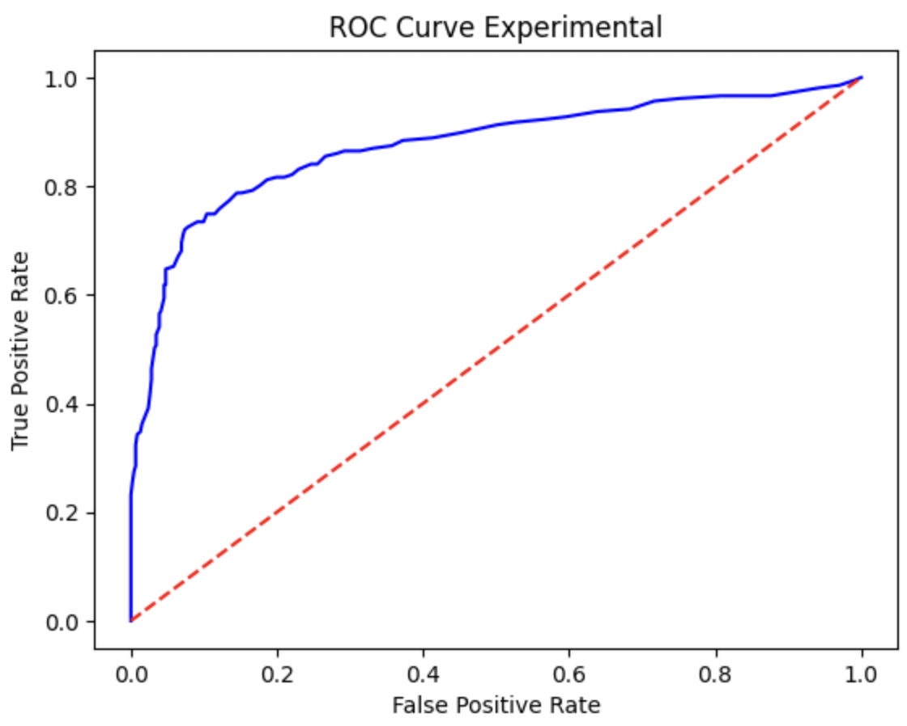

### Read the [DST.ipynb](Workspace/src/DST.ipynb) for clarity and code implementation in /code

Note: Datasets are in .csv format inside of /code directory as well

### **Paper Summary: "Debiased Self Training for Semi-Supervised Learning":**
- **Overview:** 
  The research paper titled "Debiased Self-Training for Semi-Supervised Learning" introduces an innovative approach to enhancing semi-supervised learning. It focuses on mitigating bias amplification and overfitting in traditional self-training methods by incorporating a debiased self-training technique.
- **Key Methods:** 
  The paper outlines a unique methodology that includes data preprocessing, a specialized model architecture for handling both labeled and unlabeled data, and a novel self-training algorithm with a debiasing mechanism.
- **Results and Implications:** 
  Experimental results are presented, demonstrating the effectiveness of the approach in improving the reliability and accuracy of semi-supervised learning models. The findings have significant implications for future research and applications in the field.

**Project: "Enhancing Accuracy in Semi-Supervised Learning Through Debiased Techniques"**

This project aims to explore and improve semi-supervised learning algorithms by integrating debiased techniques. The focus will be on developing a novel approach to reduce bias amplification commonly seen in traditional self-training methods. The project will investigate the impact of these debiased strategies on various datasets, comparing performance metrics with standard semi-supervised learning models. A significant component will be experimental validation, where the developed model is tested against real-world data to assess its practical viability and effectiveness.

### Volcanoes on Venus Dataset:

**Overview**

This dataset, titled "Volcanoes on Venus," was collected by the Magellan spacecraft from 1990 to 1994. It focuses on identifying volcanic features on Venus's surface using synthetic aperture radar (SAR).

**Dataset Details**

- **Source**: UCI Machine Learning Repository and JPL's Magellan webpage.
- **Objective**: To map Venus's surface and identify volcanic features.
- **Composition**: 2231 instances (731 volcanoes, 1500 non-volcanoes).
- **Features**: Each volcano is represented as a 15-by-15 pixel "chip," flattened into a 225-dimensional feature vector.
- **Classification**: Binary classification with certainty >= 0.5 for positive instances.

##**Datasets Used**
### Voting Records of the House of Representatives Dataset:

**Overview**

This dataset represents voting records from the 112th United States Congress (2011-2012), focusing on binary classification of votes as Democrat or Republican.

**Dataset Details**

- **Source**: GovTrack.
- **Scope**: Votes on popular bills, with 440 voters (196 Democrats, 244 Republicans).
- **Format**: Votes are encoded as yea ('+'), nay ('-'), or '0' (abstain).
- **Use Case**: Analysis of voting patterns and party alignment.

### Dataset and Preprocessing Summary

**Dataset Selection**

The notebook allows for the selection between two datasets: 'modified_volcanoes.csv' and 'modified_voting.csv'. The chosen dataset undergoes various preprocessing steps.

**Preprocessing Steps**

1. **Loading Data**: The selected dataset is loaded into a DataFrame.
2. **Renaming Columns**: The last column is renamed to 'class' to standardize the target attribute.
3. **Encoding (Voting Dataset)**: If 'voting' is in the dataset name, categorical variables ('+', '-', '0') are encoded numerically.
4. **Splitting Data**: The dataset is divided into labeled, unlabeled, and validation sets.
5. **Data Cleaning**: The first (index) column is excluded from all dataframes.
6. **Normalization (Volcanoes Dataset)**: If 'volcanoes' is in the dataset name, feature columns are normalized using z-score normalization.
7. **Preparing Data for Modeling**: Features (X) and targets (y) are separated for labeled, unlabeled, and validation data.

### Multilayer Perceptron Architecture

**Overview**

The Multilayer Perceptron (MLP) model implemented in the notebook is a neural network architecture for classification tasks. Key features include:

- **Initialization**: Weights and biases are initialized using a normalized random distribution. This aids in converging during training.
- **Activation Function**: Sigmoid function is used for activations, providing a smooth gradient and output range between 0 and 1.
- **Forward Propagation**: Inputs are passed through multiple layers, where each neuron's output is computed using weights, biases, and the sigmoid activation.
- **Backpropagation**: The network learns by adjusting weights and biases based on the error gradient calculated via backpropagation.
- **Training**: The model is trained over multiple epochs, updating parameters using gradient descent, to minimize the loss (e.g., Mean Squared Error).
- **Prediction**: For new inputs, the model predicts outputs based on learned weights and biases.

## Training and Evaluation with Debiased Self-Training Technique

1. **Model Setup:**
- **Generator Model:** Trains on labeled data to generate pseudo labels for unlabeled data.
- **Trained Model:** Initially identical to the generator, it trains on a combination of labeled data and pseudo-labeled data.
2. **Adversarial Optimization:**

- Adjusts the training of the Trained Model by factoring in the worst-case bias, a measure of discrepancy between pseudo and true labels. This step iteratively refines the model to reduce bias and improve reliability.

3. **Evaluation:**

- Assess the Trained Model's performance using the validation dataset, focusing on accuracy and potential biases.

This DST methodology aims to enhance model accuracy and robustness, particularly in semi-supervised learning scenarios.

### Model Evaluation Overview
In this section, we evaluate the performance of our Multilayer Perceptron model using various metrics:

- **ROC Curves**: These curves will illustrate the trade-offs between true positive rate and false positive rate at different threshold settings.
- **Accuracy Values**: We assess the overall accuracy of the model, providing a straightforward measure of its effectiveness.
- **Confusion Matrices**: These matrices offer a detailed view of the model's performance, highlighting true positives, false negatives, false positives, and true negatives.

### Class Accuracy Analysis

The histograms displaying class accuracy for the standard and experimental models reveal noteworthy differences:

- **Standard Model**: This model shows lower accuracy for one of the two classes. This discrepancy could indicate a potential bias or deficiency in handling certain types of data.
- **Experimental Model**: In comparison, it appears to have a more balanced performance across classes.

These graphs provide valuable insights into each model's ability to generalize across different classes, highlighting areas where model tuning might be necessary to improve overall accuracy and balance.
#### Experimental Results

#### Standard Results

### ROC Curve Analysis

This section delves into the analysis of ROC (Receiver Operating Characteristic) curves for both the standard and experimental models:

- **ROC Curve Insights**: The curves offer a visual representation of the trade-off between the true positive rate (TPR) and false positive rate (FPR) at various threshold levels.
- **Comparative Analysis**: By examining the area under the curve (AUC) for each model, we can gauge their overall performance in distinguishing between classes.
- **Strategic Evaluation**: This analysis helps in understanding how each model performs in differentiating true positives from false positives, crucial for fine-tuning thresholds in classification tasks.

#### Standard Curve

#### Experimental Curve

## Analysis of ROC Curve Metrics

The ROC curve metrics for both adversarial and standard optimization methods indicate a significant difference in model performance:

1. **Adversarial Optimization:**

- **High TPR Maintenance:** Maintains a high True Positive Rate (TPR) across a wide range of thresholds, indicating strong sensitivity and the model's ability to correctly identify positive instances.

- **Lower FPR at Higher Thresholds:** Exhibits a lower False Positive Rate (FPR) at higher thresholds, suggesting improved specificity compared to the standard method.

1. **Standard Optimization:**

- **Decline in TPR:** Shows a more significant drop in TPR as the threshold increases, implying reduced sensitivity.

- **Higher FPR:** Exhibits a higher FPR across most thresholds, indicating more false alarms or false positives.

### Conclusion:

- The **Adversarial Optimization** technique demonstrates superior performance, particularly in maintaining a balance between sensitivity (TPR) and specificity (lower FPR). This suggests its effectiveness in producing a model that not only correctly identifies more positive instances but also maintains a lower rate of false positives, making it a more robust and reliable approach in comparison to standard training methods.

### Confusion Matrix Analysis

This section focuses on the analysis of confusion matrices for both the standard and experimental models. A confusion matrix provides a comprehensive view of the model's performance, categorizing predictions into four segments:

- **True Positives (TP):** Correct positive predictions.
- **False Positives (FP):** Incorrect positive predictions.
- **True Negatives (TN):** Correct negative predictions.
- **False Negatives (FN):** Incorrect negative predictions.

We will examine these metrics to understand the models' abilities in correctly classifying and differentiating between classes, which is crucial for evaluating their effectiveness and reliability.
#### Confusion Graphs

### Comparative Analysis of Experimental and Standard Model Metrics Confusion Metrics (Volcanoes Dataset)

The performance metrics between the Experimental and Standard models show significant differences:

- **True Positives (TP):** The Experimental Model significantly outperforms the Standard Model in identifying positive cases (445 vs. 411).

- **False Negatives (FN):** The Experimental Model has considerably fewer FNs (17 vs. 51), indicating better sensitivity in correctly identifying positive cases.

- **False Positives (FP):** The Experimental Model has a higher number of FPs (97 vs. 54), suggesting a more aggressive approach in predicting positives.

- **True Negatives (TN):** The Standard Model performs better in correctly identifying negative cases (153 TNs vs. 110 TNs for the Experimental Model).

In summary, the Experimental Model excels in identifying positive cases, but at the cost of increased false positives, while the Standard Model is more conservative, resulting in fewer false positives but more false negatives.

### Project Conclusion and Reflections

In conclusion, my exploration and implementation of debiased semi-supervised learning techniques, particularly through the "Debiased Self-Training for Semi-Supervised Learning" paper, have provided valuable insights and practical results. My experimental model showed improved balance in class accuracy and sensitivity, as seen in the class accuracy histograms and ROC curve analysis. Although it predicted more false positives, it excelled in identifying true positives and reducing false negatives. This project highlights the effectiveness of debiased strategies in semi-supervised learning, offering a path towards more accurate and reliable models.

### Citation

- **Title**: Debiased Self-Training for Semi-Supervised Learning
- **Authors**: Baixu Chen, Junguang Jiang, Ximei Wang, Pengfei Wan, Jianmin Wang, Mingsheng Long
- **Conference**: NIPS 2022
- **Comments**: Oral Presentation
- **Subjects**: Machine Learning (cs.LG); Computer Vision and Pattern Recognition (cs.CV)
- **MSC Classes**: Machine Learning
- **Cite as**: arXiv:2202.07136 [cs.LG]
- **Version**: arXiv:2202.07136v5 [cs.LG]
