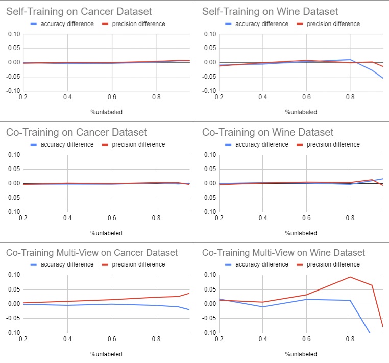

-----
## **1. Survey**
-----
### **Paper 1: "Self-Training: A Survey"**
- **Overview**: This paper goes over self training, a semi-supervised process by which any learner creates a hypothesis using only the labeled data, then classifies the unlabeled data, adding labels to the data points when the classifier has a high enough classification confidence. This paper goes over a number of methods and variations of self training. Variations on the method consider different strategies for choosing which unlabeled points to give pseudo labels to, anomaly detection, threshold setting, ect. 
### **Paper 2: "A Review of Research on Co-Training"**
- **Overview**: This paper goes over co-training, a semi-supervised process by which two learners are trained using labeled data, then classifies the unlabeled data and adds confident pseudo-labels to the other classifier. This only works under the assumption that the two learners are independent. This is typically done by using two “views” of the data, where a view of the dataset is a subset of features less than the number of features available. These views should be independent but also robust enough to make confident predictions of the labels.

-----
## **2. Methods**
-----
### **Method 1: "Self-Training"**
- **Description**: The SelfTrain class is a semi-supervised binary self-training classifier. When fitting to data, the model first trains on all labeled datapoints, then attempts to classify the unclassified datapoints. Depending on input, the algorithm will either choose the k best unlabeled points to give pseudo-labels, or will choose all points above a certain threshold confidence to give pseudo-labels. These newly labeled points will be added to the training set and a new iteration of the algorithm will start. This continues until either no points are added or there are no more unlabeled datapoints. The confidence is taken from predict_proba, a method inherited from the input model (see Parameters)
- **Functions**:
  - fit(X, y) takes two ndarrays, one with the numeric examples, and the other with binary labels, -1, 0, or 1. Labels of -1 will be interpreted as unlabeled.
  - predict(X) takes one ndarray as an array of datapoints to classify, and will return a list of predicted labels
- **Parameters**:
  - model: When creating an instance of SelfTrain, a model must be given. This model must be a sklearn classifier that implements fit() and predict_proba(), as those methods are used in the model.
  - k_highest: if criterion = 'k_highest', this parameter determines how many unlabeled points are given pseudo-labels each iteration. default 10
  - threshold: if criterion = 'threshold', this parameter determines the threshold at which unlabeled points will be given pseudo-labels. 
  - criterion: can either be set to 'threshold' or 'k_highest'. Sets the criterion for determining which datapoints get pseudo-labels.
### **Method 2: "Co-Training"**
- **Description**: The CoTrain class is a semi-supervised binary co-training classifier. When fitting to data, first, each individual classifier learns the labeled data, then predicts all the unlabeled examples. Of n classifiers, if >= n-1 of them agree on a label, it is added to the labeled dataset with a pseudo-label.
- **Functions**:
  - fit(X, y) takes two ndarrays, one with the numeric examples, and the other with binary labels, -1, 0, or 1. Labels of -1 will be interpreted as unlabeled.
  - predict(X) takes one ndarray as an array of datapoints to classify, and will return a list of predicted labels
- **Parameters**:
  - models: when creating an instance of CoTrain, a list of models should be provided. At least 3 models are needed for the majority voting system to work. These models must be sklearn classifiers that implement fit() and predict(), as those methods are used in the model.

-----
## **3. Research**
-----
### **Multi-View Co-Training**
- **Description**: Co-Training works because classifiers are independent, so the confidence of one classifier can boost another classifier. In the base Co-Training model, this independence is achieved by using different base classifiers, but it is also possible to achieve independence by providing the same classifier with a different "view" of the data. A view is a subset of the features. The nontrivial part of the research extension is finding a split for the views where they are independent and still contain useful information about the label. Some features can contain redundant information, so it's important to make sure the features that share information are on the same side of the split.
- **Algorithm**: Since we want to minimize the dependence between each split, we look at the sum of conditional mutual information between every pair of features between the split and minimize that. First we calculate the conditional mutual information between every pair of variables, and create an undirected graph where the vertices are features and there is an edge between every pair of vertices with the weight of their conditional mutual information. We then use the Kernighan–Lin algorithm to find the split that minimizes the sum of weights between the two splits.

-----
## **4. Results, Analysis and Discussion**
-----
### **Results**:
I tested each method and the research extension for performance. I tracked the difference in accuracy and precision before and after the model was trained with the unlabeled points. (before training with unlabeled points means the base algorithm only trained with the labeled data). This is a metric on how effective the semi-supervised learning wrapper method is compared to the classifier being wrapped.
For the self-trainer, I used a random forest classifier
For the co-trainer, I used a gaussian naive bayes, K nearest neighbors, and decision tree classifier
For the co-training view model, I used a random forest classifier
For each graph, I ran the model 30 times each with a different combination of hidden datapoints

### **Analysis and Discussion**:
Self-Training and Co-Training both make negligible impacts on performance compared to multi-view co-training.
I believe this difference is due to the fact that there is too much dependence between the single views in co-training, meaning that the differentiation caused by different base classifier types is not enough to provide a meaningful difference. And for self-training, since labels are assigned and used by the same classifier, it is too easy for a wrong classification to cause more wrong classifications down the line.
A major difficulty while implementing self-training was that base classifiers didn't report detailed enough probability estimates to meaningfully strain out high-confidence classifications from low-confidence ones. The random-forest classifier was the only classifier I found that gave reasonable probability estimates. 

-----
## **5. Bibliography**
-----
Papers Used:
[1] Amini, M.-R., Feofanov, V., Pauletto, L., Hadjadj, L., Devijver, E., & Maximov, Y. (2023, September 18). Self-Training: A Survey.
[2] Ning, X., Cai, W., Liping, Z., & Yu, L. (2021, February 5). A Review of Research on Co-Training.
[3] Zhu, X. (2008, July 19). Semi-Supervised Learning Literature Survey.
[4] Feger, F., & Koprinska, I. (2006, July 21). Co-training using RBF Nets and Different Feature Splits.
Packages Used:
sklearn
numpy
